# reinforcement-learning-from-scratch

This repository is a week-by-week reinforcement learning implementation series based mainly on Sutton and Barto's *Reinforcement Learning: An Introduction*. The goal is to build core RL ideas from scratch in clean, readable Python while documenting the reasoning and results in a portfolio-friendly way.

The project motivation is straightforward: reinforcement learning concepts become much clearer when the underlying environments, agents, updates, and evaluation loops are implemented directly rather than treated as black boxes.

Current roadmap at a high level:
- Week 1: epsilon-greedy action selection in the 10-armed bandit problem
- Week 2: optimistic initial values and Upper-Confidence-Bound (UCB) action selection
- Week 3: gradient bandit algorithms with and without a reward baseline
- Week 4: finite Markov Decision Processes with a Gridworld policy comparison
- Future weeks: additional chapters and algorithms will be added incrementally

Current repository structure:

```text
reinforcement-learning-from-scratch/
|-- README.md
|-- requirements.txt
|-- .gitignore
|-- notes/
|   |-- week_01_epsilon_greedy_bandits.md
|   |-- week_02_optimistic_initial_values_ucb.md
|   |-- week_03_gradient_bandits.md
|   `-- week_04_finite_markov_decision_processes.md
|-- notebooks/
|   |-- week_01_epsilon_greedy_bandits.ipynb
|   |-- week_02_optimistic_initial_values_ucb.ipynb
|   |-- week_03_gradient_bandits.ipynb
|   `-- week_04_gridworld_mdp_policy_comparison.ipynb
|-- src/
|   |-- __init__.py
|   |-- bandits/
|   |   |-- __init__.py
|   |   |-- agents.py
|   |   |-- environment.py
|   |   `-- experiments.py
|   |-- gridworld/
|   |   |-- __init__.py
|   |   |-- environment.py
|   |   |-- policies.py
|   |   `-- experiments.py
|   `-- utils/
|       |-- __init__.py
|       `-- plotting.py
|-- results/
|   |-- week_01/
|   |   |-- average_reward.png
|   |   `-- optimal_action_percentage.png
|   `-- week_02/
|       |-- optimistic_initial_values_average_reward.png
|       |-- optimistic_initial_values_optimal_action.png
|       |-- ucb_average_reward.png
|       `-- ucb_optimal_action.png
|   |-- week_03/
|       |-- gradient_bandit_average_reward.png
|       `-- gradient_bandit_optimal_action.png
|   `-- week_04/
|       |-- average_return_by_policy.png
|       |-- average_episode_length_by_policy.png
|       |-- success_rate_by_policy.png
|       `-- state_visitation_heatmap.png
`-- tests/
    |-- test_bandits.py
    `-- test_gridworld.py
```

## Week 1

Week 1 implements the 10-armed bandit testbed and compares `epsilon = 0`, `epsilon = 0.01`, and `epsilon = 0.1` using sample-average action-value estimation. Performance is evaluated with average reward and percentage optimal action.

Key insight: a pure greedy strategy can get stuck after early lucky rewards, while epsilon-greedy improves long-term learning by continuing to explore.

### Week 1 Results

Average reward:

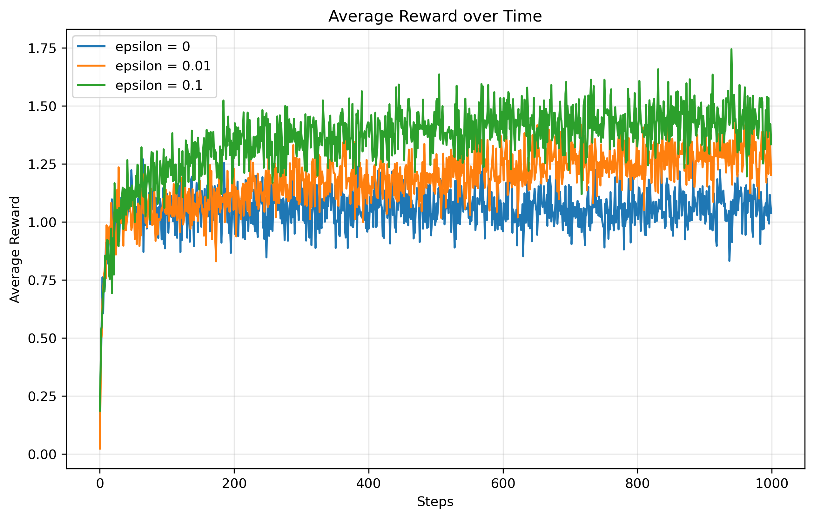

Optimal action percentage:

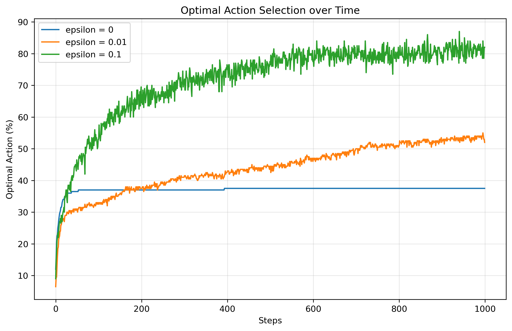

## Week 2 - Optimistic Initial Values and UCB

This week extends the 10-armed bandit setup from Week 1 by comparing two other exploration strategies: optimistic initial values and Upper-Confidence-Bound (UCB) action selection.

Concepts:
- Constant step-size updates for nonstationary problems
- Optimistic initial values
- UCB action selection
- Directed exploration through uncertainty

Experiments:
1. Epsilon-greedy vs optimistic greedy
2. Epsilon-greedy vs UCB

Parameter choices:
- Q<sub>0</sub> = 5 for optimistic greedy so the initial estimates are clearly optimistic relative to the usual reward range
- `c = 2` for UCB as a simple baseline that makes the uncertainty bonus visible without overwhelming the value estimates

Results:

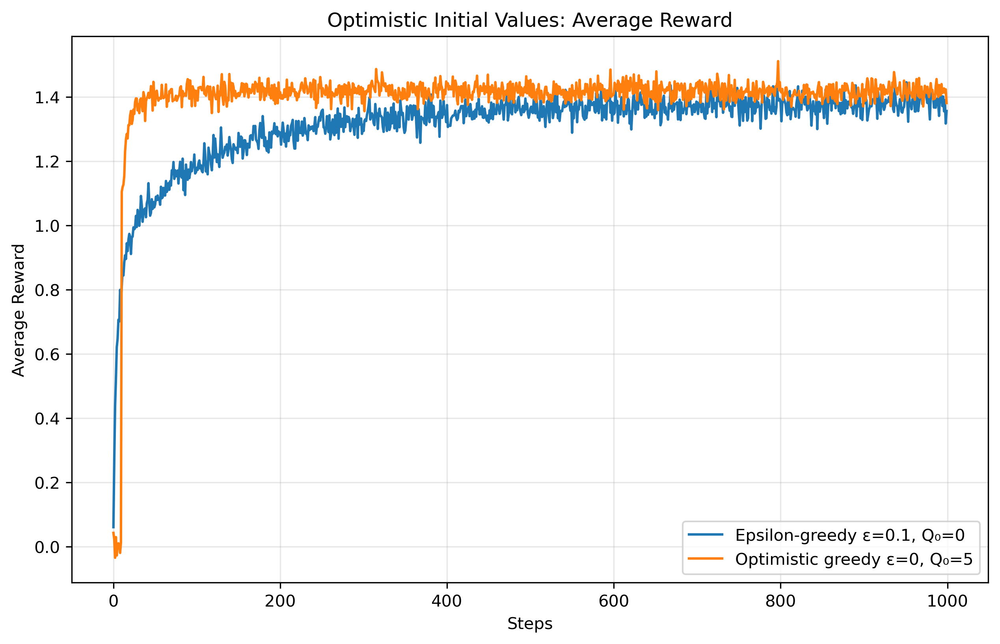
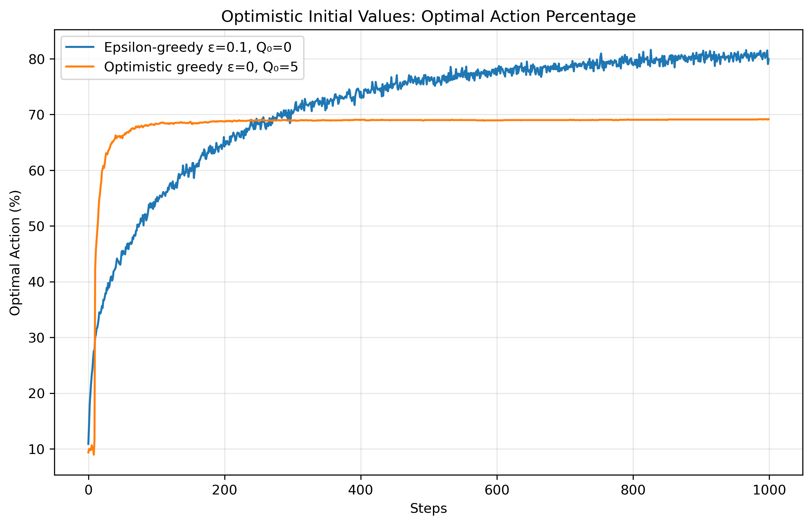
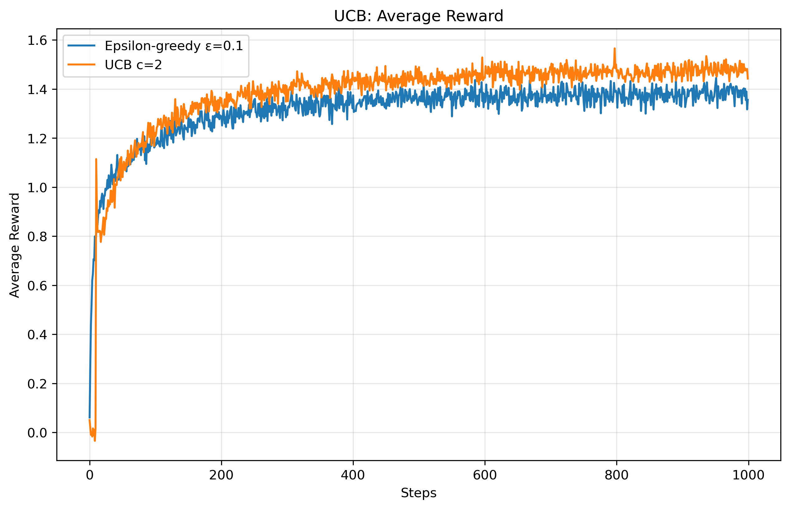
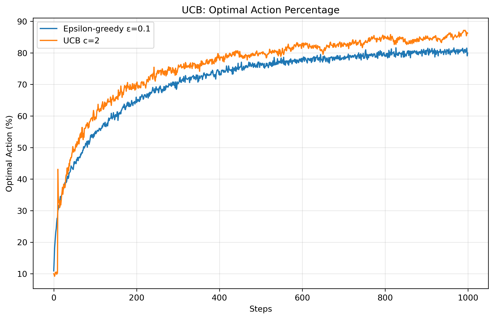

In the optimistic-initial-values comparison, the greedy agent explores aggressively at the start because every action begins with an inflated estimate. That helps it discover strong actions early, but the effect fades once those initial estimates are corrected, so its exploration is front-loaded rather than persistent.

In the UCB comparison, the curves are usually smoother after the initial warm-up because exploration is tied to uncertainty instead of random action picks. That makes UCB more deliberate than epsilon-greedy, especially once the agent has enough data to start favoring promising but under-sampled actions.

Key insight: optimistic initial values encourage early exploration by making untried actions look attractive, while UCB explores more deliberately by combining estimated value with an uncertainty bonus.

## Week 3 - Gradient Bandit Algorithms

This week implements gradient bandit algorithms, moving from action-value methods toward direct policy learning.

Concepts:
- Action preferences `H(a)`
- Softmax action selection
- Gradient bandit preference updates
- Reward baseline
- Comparison with and without baseline

Experiment:
- 10-armed bandit testbed
- True action values shifted upward with mean `4.0`
- Compare gradient bandits with and without reward baseline
- Compare learning rates `alpha = 0.1` and `alpha = 0.4`

Results:

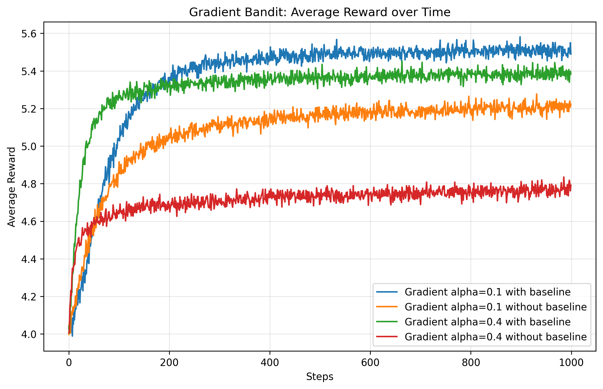
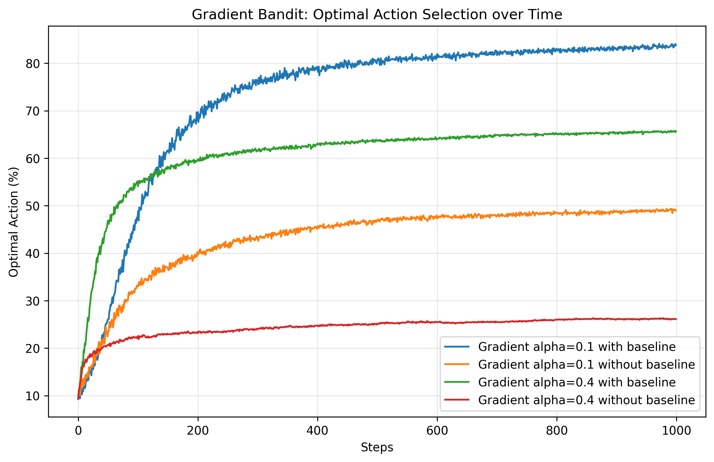

Key insight: gradient bandits do not directly estimate action values. They learn action preferences and use softmax to convert those preferences into action probabilities. The reward baseline improves learning by helping the agent judge whether a reward was better or worse than expected.

## Week 4 - Finite Markov Decision Processes

This week moves from bandits to finite Markov Decision Processes by implementing a Gridworld environment and comparing fixed policies.

Concepts:
- Agent-environment interface
- States, actions, rewards, transitions
- Markov property
- Returns and discounting
- Episodic tasks
- Policies

Experiment:
- Built a `5 x 5` Gridworld MDP
- Compared `RandomPolicy`, `GoalDirectedPolicy`, and `BadPolicy`
- Measured average return, average episode length, success rate, and state visitation frequency

Results:

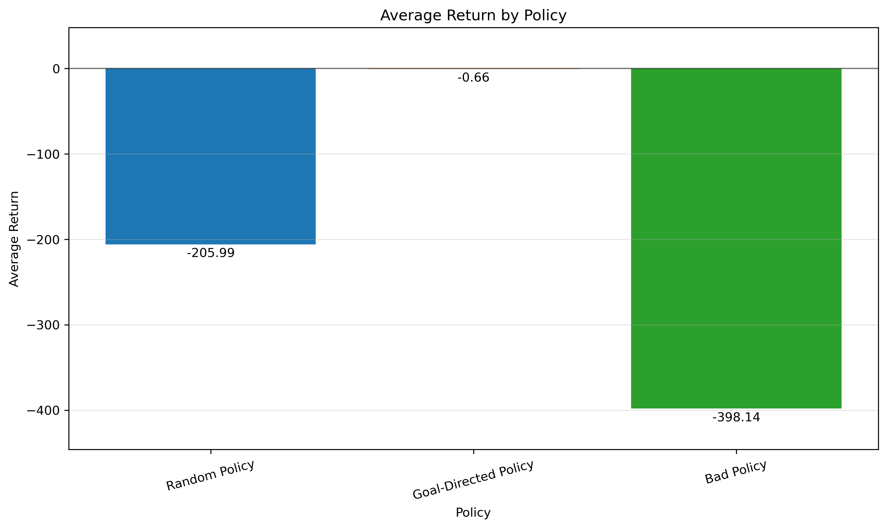
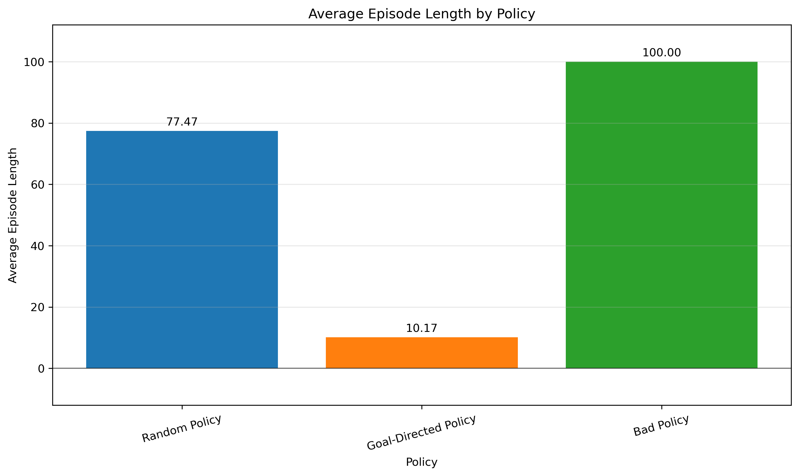
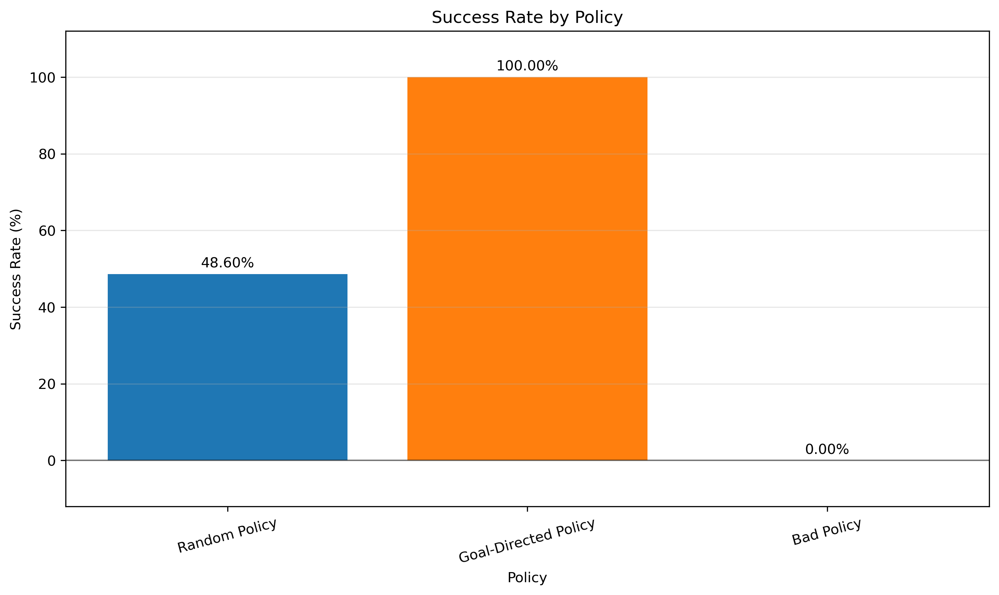
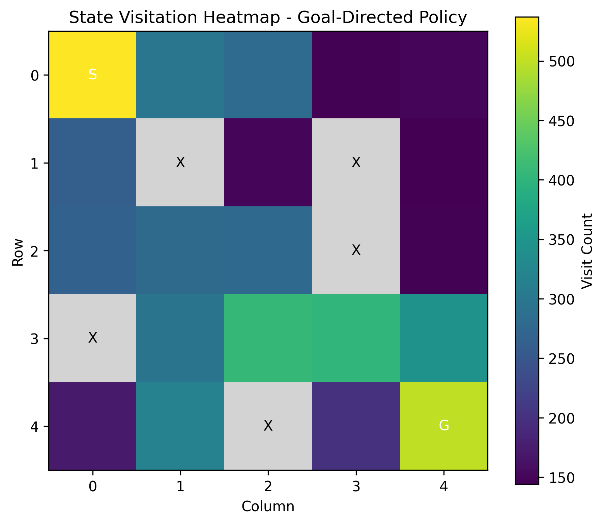

Key insight: MDPs extend bandits by introducing states and transitions. A policy is no longer just about selecting a good action overall; it must select actions based on the current state to improve long-term return.

Reference:
- Richard S. Sutton and Andrew G. Barto, *Reinforcement Learning: An Introduction*.
