# reinforcement-learning-from-scratch

This repository is a week-by-week reinforcement learning implementation series based mainly on Sutton and Barto's *Reinforcement Learning: An Introduction*. The goal is to build core RL ideas from scratch in clean, readable Python while documenting the reasoning and results in a portfolio-friendly way.

The project motivation is straightforward: reinforcement learning concepts become much clearer when the underlying environments, agents, updates, and evaluation loops are implemented directly rather than treated as black boxes.

Current roadmap at a high level:
- Week 1: epsilon-greedy action selection in the 10-armed bandit problem
- Week 2: optimistic initial values and Upper-Confidence-Bound (UCB) action selection
- Week 3: gradient bandit algorithms with and without a reward baseline
- Week 4: finite Markov Decision Processes with a Gridworld policy comparison
- Week 5: value functions and iterative policy evaluation in Gridworld
- Week 6: Dynamic Programming policy iteration in Gridworld
- Week 7: Dynamic Programming value iteration in Gridworld
- Week 8: Monte Carlo prediction with First-Visit Monte Carlo in Gridworld
- Future weeks: additional chapters and algorithms will be added incrementally

Current repository structure:

```text
reinforcement-learning-from-scratch/
|-- README.md
|-- requirements.txt
|-- .gitignore
|-- notes/
|   |-- week_01_epsilon_greedy_bandits.md
|   |-- week_02_optimistic_initial_values_ucb.md
|   |-- week_03_gradient_bandits.md
|   |-- week_04_finite_markov_decision_processes.md
|   |-- week_05_value_functions_policy_evaluation.md
|   |-- week_06_policy_iteration.md
|   |-- week_07_value_iteration.md
|   `-- week_08_first_visit_monte_carlo_prediction.md
|-- notebooks/
|   |-- week_01_epsilon_greedy_bandits.ipynb
|   |-- week_02_optimistic_initial_values_ucb.ipynb
|   |-- week_03_gradient_bandits.ipynb
|   |-- week_04_gridworld_mdp_policy_comparison.ipynb
|   |-- week_05_value_functions_policy_evaluation.ipynb
|   |-- week_06_policy_iteration.ipynb
|   |-- week_07_value_iteration.ipynb
|   `-- week_08_first_visit_monte_carlo_prediction.ipynb
|-- src/
|   |-- __init__.py
|   |-- bandits/
|   |   |-- __init__.py
|   |   |-- agents.py
|   |   |-- environment.py
|   |   `-- experiments.py
|   |-- gridworld/
|   |   |-- __init__.py
|   |   |-- environment.py
|   |   |-- policies.py
|   |   |-- experiments.py
|   |   |-- policy_evaluation.py
|   |   |-- policy_iteration.py
|   |   `-- value_iteration.py
|   |-- monte_carlo.py
|   `-- utils/
|       |-- __init__.py
|       `-- plotting.py
|-- results/
|   |-- week_01/
|   |-- week_02/
|   |-- week_03/
|   |-- week_04/
|   |-- week_05/
|       |-- random_policy_value_function.png
|       |-- goal_directed_policy_value_function.png
|       |-- value_convergence.png
|       `-- policy_value_comparison.png
|   |-- week_06/
|   |-- week_07/
|       |-- value_iteration_convergence.png
|       |-- value_iteration_final_values.png
|       |-- value_iteration_greedy_policy.png
|       `-- value_vs_policy_iteration_sweeps.png
|   `-- week_08/
|       |-- dp_vs_mc_values.png
|       |-- mc_error_over_episodes.png
|       |-- mc_value_estimates.png
|       `-- sample_episode_path.png
`-- tests/
    |-- test_bandits.py
    |-- test_gridworld.py
    `-- test_monte_carlo.py
```

## Week 1

Week 1 implements the 10-armed bandit testbed and compares `epsilon = 0`, `epsilon = 0.01`, and `epsilon = 0.1` using sample-average action-value estimation. Performance is evaluated with average reward and percentage optimal action.

Key insight: a pure greedy strategy can get stuck after early lucky rewards, while epsilon-greedy improves long-term learning by continuing to explore.

### Week 1 Results

Average reward:


Optimal action percentage:


## Week 2 - Optimistic Initial Values and UCB

This week extends the 10-armed bandit setup from Week 1 by comparing two other exploration strategies: optimistic initial values and Upper-Confidence-Bound (UCB) action selection.

Concepts:
- Constant step-size updates for nonstationary problems
- Optimistic initial values
- UCB action selection
- Directed exploration through uncertainty

Experiments:
1. Epsilon-greedy vs optimistic greedy
2. Epsilon-greedy vs UCB

Parameter choices:
- Q<sub>0</sub> = 5 for optimistic greedy so the initial estimates are clearly optimistic relative to the usual reward range
- `c = 2` for UCB as a simple baseline that makes the uncertainty bonus visible without overwhelming the value estimates

Results:


In the optimistic-initial-values comparison, the greedy agent explores aggressively at the start because every action begins with an inflated estimate. That helps it discover strong actions early, but the effect fades once those initial estimates are corrected, so its exploration is front-loaded rather than persistent.

In the UCB comparison, the curves are usually smoother after the initial warm-up because exploration is tied to uncertainty instead of random action picks. That makes UCB more deliberate than epsilon-greedy, especially once the agent has enough data to start favoring promising but under-sampled actions.

Key insight: optimistic initial values encourage early exploration by making untried actions look attractive, while UCB explores more deliberately by combining estimated value with an uncertainty bonus.

## Week 3 - Gradient Bandit Algorithms

This week implements gradient bandit algorithms, moving from action-value methods toward direct policy learning.

Concepts:
- Action preferences `H(a)`
- Softmax action selection
- Gradient bandit preference updates
- Reward baseline
- Comparison with and without baseline

Experiment:
- 10-armed bandit testbed
- True action values shifted upward with mean `4.0`
- Compare gradient bandits with and without reward baseline
- Compare learning rates `alpha = 0.1` and `alpha = 0.4`

Results:


Key insight: gradient bandits do not directly estimate action values. They learn action preferences and use softmax to convert those preferences into action probabilities. The reward baseline improves learning by helping the agent judge whether a reward was better or worse than expected.

## Week 4 - Finite Markov Decision Processes

This week moves from bandits to finite Markov Decision Processes by implementing a Gridworld environment and comparing fixed policies.

Concepts:
- Agent-environment interface
- States, actions, rewards, transitions
- Markov property
- Returns and discounting
- Episodic tasks
- Policies

Experiment:
- Built a `5 x 5` Gridworld MDP
- Compared `RandomPolicy`, `GoalDirectedPolicy`, and `BadPolicy`
- Measured average return, average episode length, success rate, and state visitation frequency

Results:


Key insight: MDPs extend bandits by introducing states and transitions. A policy is no longer just about selecting a good action overall; it must select actions based on the current state to improve long-term return.

## Week 5 - Value Functions and Policy Evaluation

This week builds on the Gridworld MDP from Week 4 and implements iterative policy evaluation to compute state-value functions for fixed policies.

Concepts:
- State-value function v<sub>pi</sub>(s)
- Action-value function q<sub>pi</sub>(s, a)
- Bellman expectation equation
- Bellman backup
- Iterative policy evaluation
- Value function convergence

Experiment:
- Evaluated `RandomPolicy`, `GoalDirectedPolicy`, and `BadPolicy` in Gridworld using iterative policy evaluation
- Computed state-value functions by applying Bellman backups until convergence (gamma=0.9, theta=1e-4)
- Visualised representative Gridworld value-function heatmaps and compared all three policies numerically
- Plotted convergence of max-delta across sweeps
- Compared average non-terminal state values across policies
- Traced one manual Bellman backup at the start state to illustrate the update

Results:

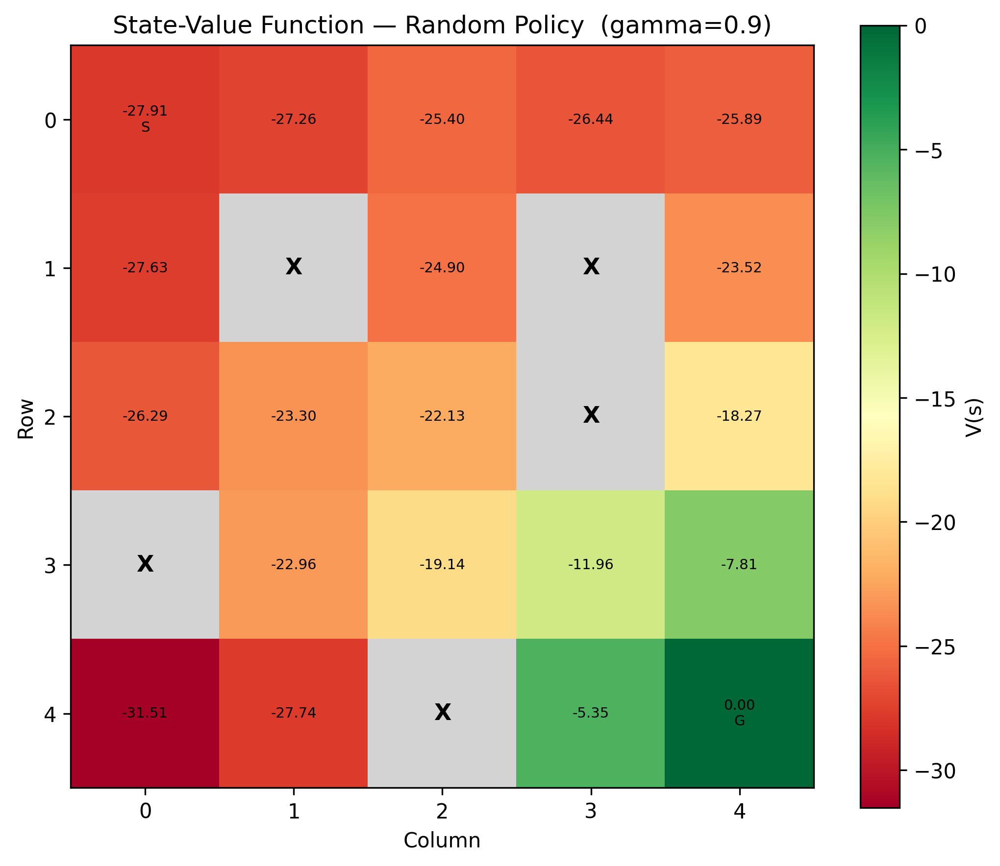
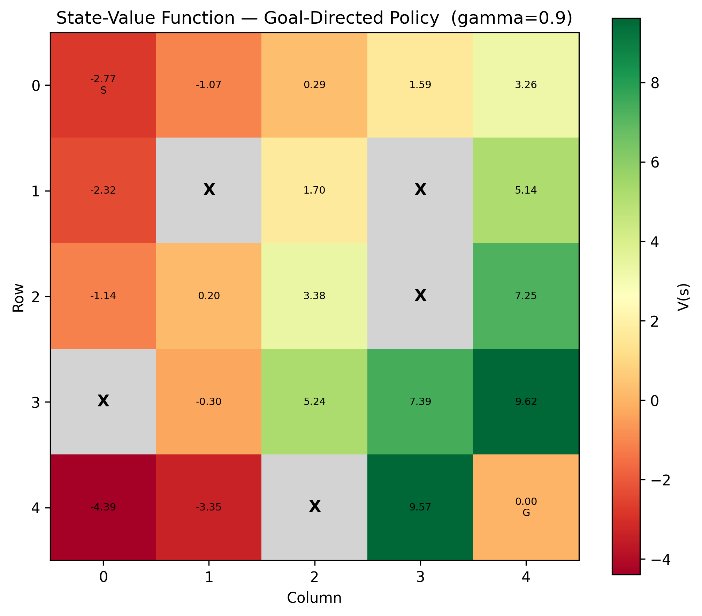
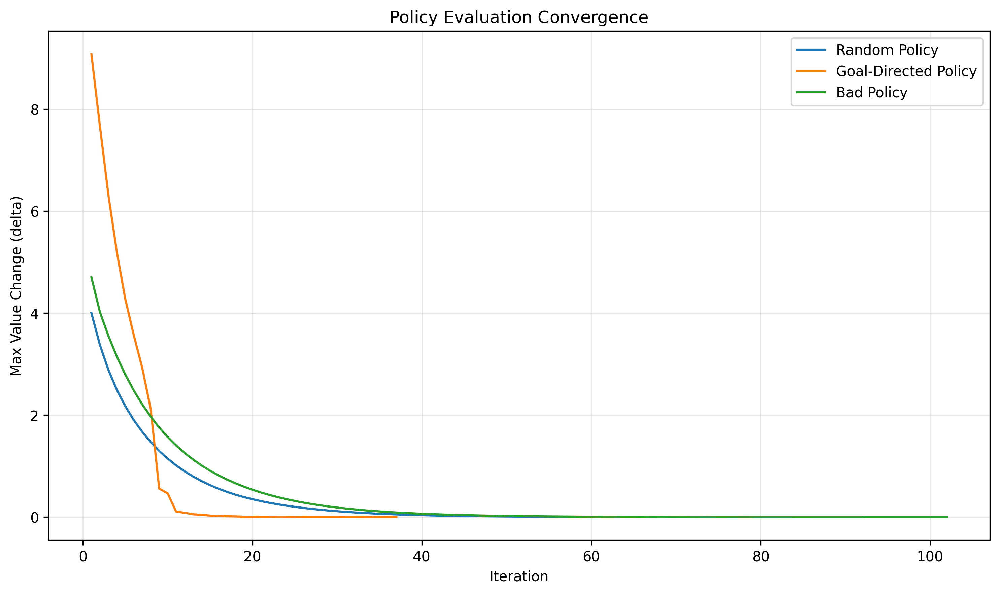
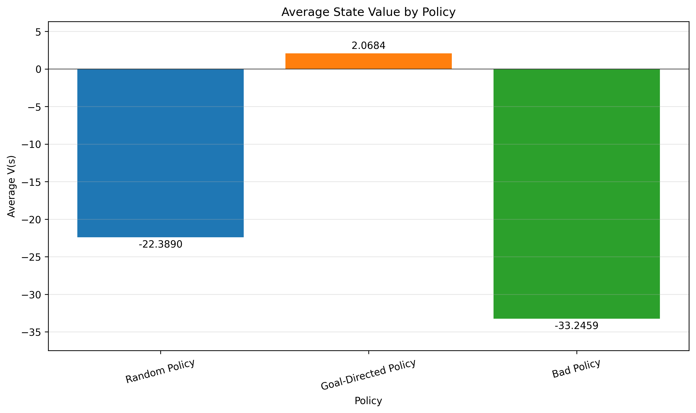

Key insight: policy evaluation computes how good each state is under a fixed policy. The Bellman expectation equation makes this possible by expressing state value as expected immediate reward plus discounted next-state value. This prepares the ground for policy improvement in Week 6.

## Week 6 - Dynamic Programming: Policy Iteration

This week extends Week 5 by improving a deterministic Gridworld policy with Dynamic Programming.

Concepts:
- Policy evaluation
- Policy improvement
- One-step lookahead
- Greedy policy improvement
- Policy stability
- Policy iteration

Experiment:
- Started with a random deterministic policy
- Evaluated the policy using iterative policy evaluation
- Improved the policy greedily using one-step lookahead
- Repeated evaluation and improvement until the policy became stable
- Visualized the initial policy, final policy, final value function, and policy changes over iterations

Results:

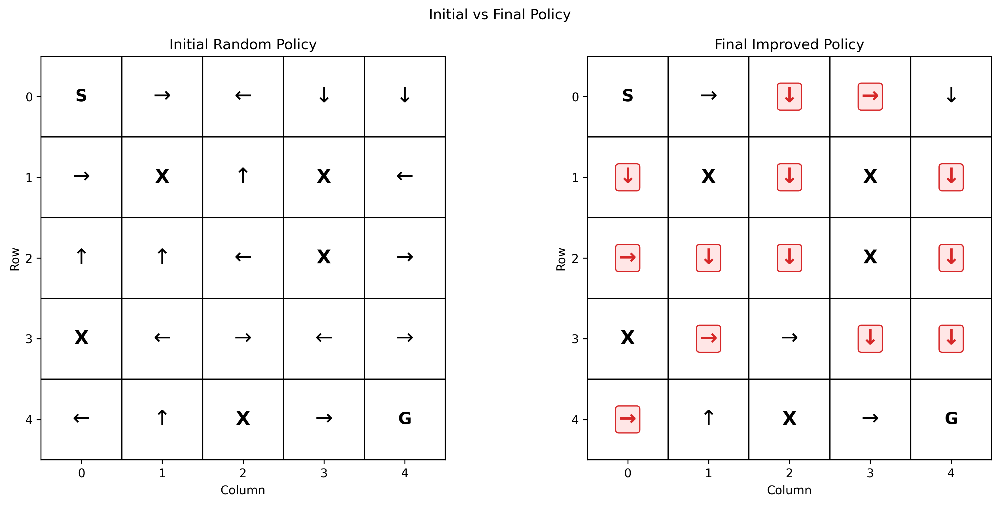

Key insight: policy iteration alternates between evaluating the current policy and improving it greedily using the value function. When the policy stops changing, it has reached a stable solution for the finite MDP.

## Week 7 - Dynamic Programming: Value Iteration

This week keeps the same Gridworld from Weeks 4 to 6 and implements value iteration to compute the optimal value function directly.

Concepts:
- Bellman optimality equation
- Bellman optimality backup
- Value iteration
- Greedy policy extraction
- Comparison with policy iteration

Experiment:
- Ran value iteration on the existing deterministic Gridworld
- Updated each non-terminal state with the Bellman optimality backup until convergence
- Extracted the final greedy policy from the converged value function
- Visualized the final value function, final greedy policy, and convergence over sweeps
- Compared the resulting values and policy against Week 6 policy iteration

Results:

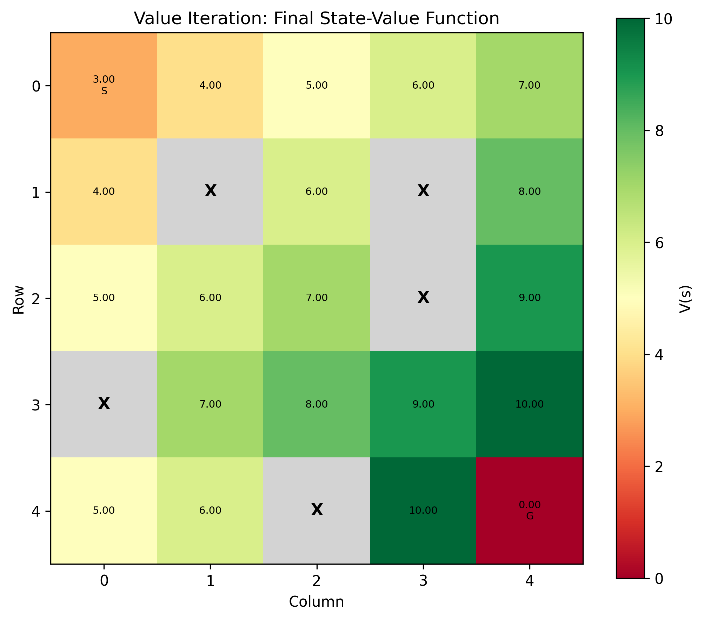
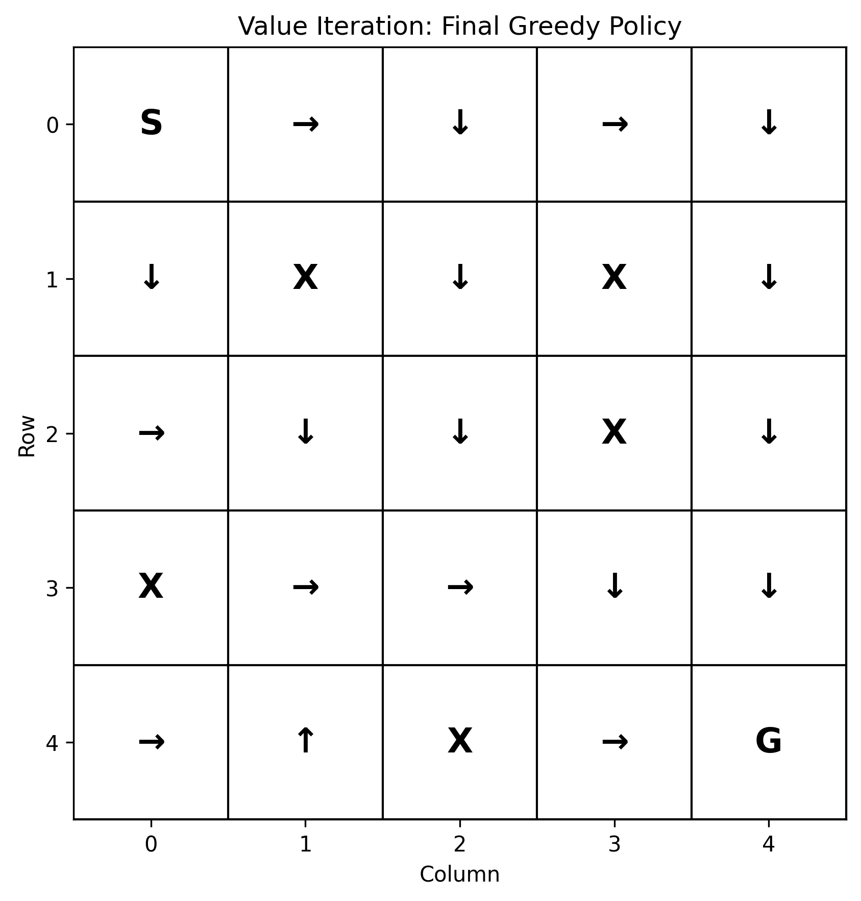
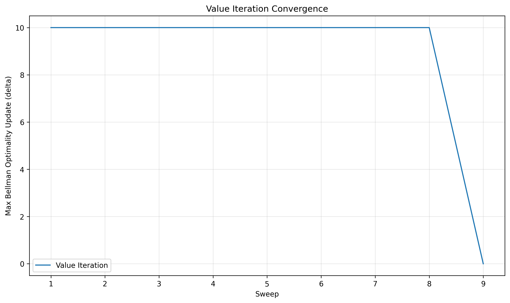
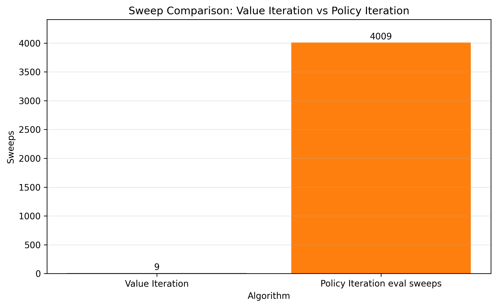

Key insight: value iteration merges evaluation and improvement into a single repeated optimality update. In this Gridworld, it converges to the same optimal value function and greedy policy as policy iteration, while using a different computational pattern.

## Week 8 - Monte Carlo Methods: First-Visit Prediction

This week shifts from model-based Dynamic Programming to model-free prediction by estimating state values from sampled episodes.

Concepts:
- Episodes and returns
- First-Visit Monte Carlo prediction
- First-Visit vs Every-Visit Monte Carlo
- Model-free prediction
- Comparison with Dynamic Programming policy evaluation

Experiment:
- Reused the existing Gridworld as an interactive environment for episode sampling
- Generated episodes under a fixed `GoalDirectedPolicy`
- Computed returns backward for each sampled episode
- Updated `V(s)` only on the first visit to each state per episode
- Compared the final Monte Carlo estimate against Week 5 iterative policy evaluation
- Tracked mean absolute error over the number of sampled episodes

Results:

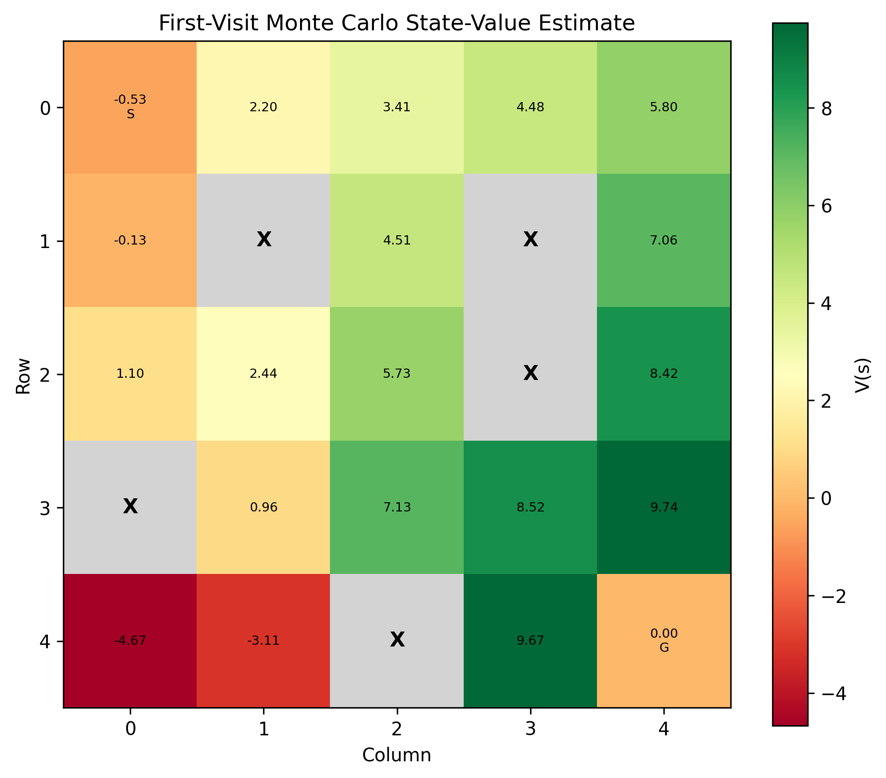
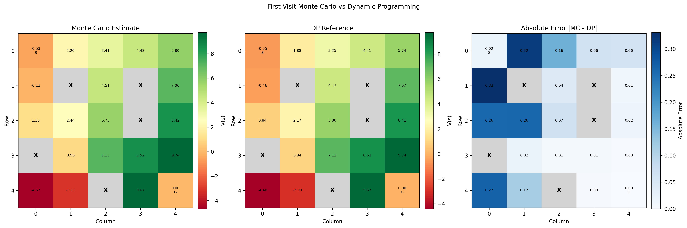
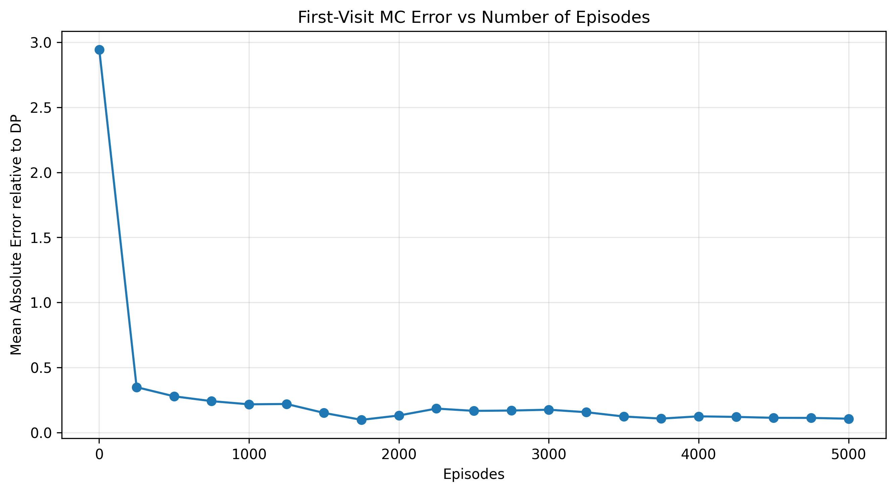
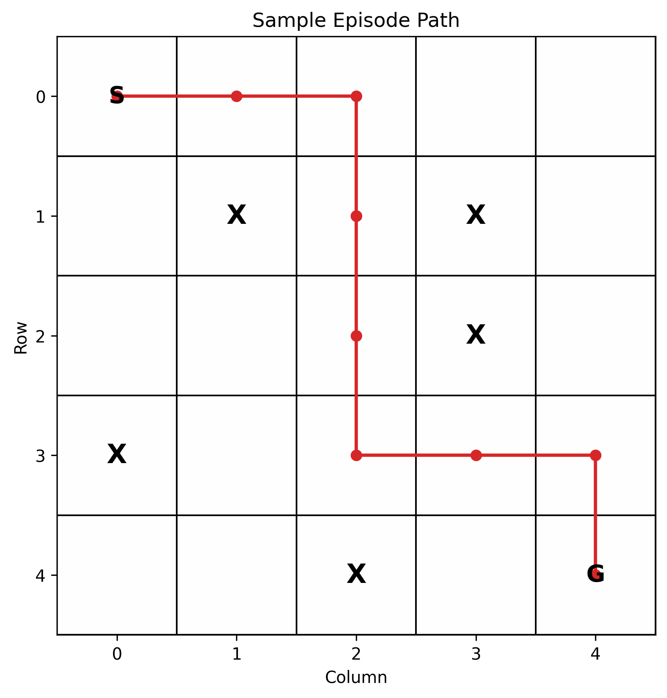

Key insight: First-Visit Monte Carlo estimates v<sub>pi</sub>(s) without using the environment model. Instead of Bellman expectation backups, it averages complete sampled returns after first visits to each state. With enough episodes, the MC estimates move close to the Dynamic Programming reference values for the same fixed policy.

Reference:
- Richard S. Sutton and Andrew G. Barto, *Reinforcement Learning: An Introduction*.
